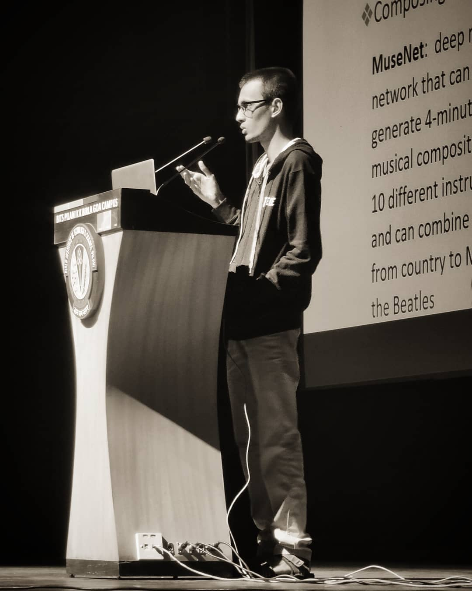



My research interests focus on bridging the gap between biological and computational models of natural language processing. This involves inspecting biological plausibility of the existing language models for various tasks, behavioural modelling of language learning & understanding and building robust computational models of language.

I am currently actively following these topics:

* *Adversarial Learning in Natural Language Processing*
* *Bias in NLP models*
* *Automatic Scoring of Text and Speech Quality*
* *Multimodality in Language Learning*
* *Neural Discourse Models* 

&nbsp;
&nbsp;

Currently, I am pursuing my Bachelor's Thesis at [IIIT Delhi](https://www.iiitd.ac.in/) under the guidance of Prof. [Rajiv Ratn Shah](https://www.iiitd.ac.in/rajivratn) on the topic: *Speech Processing*. I am actively seeking collaborations and research interns for currently active projects on *Computational Psycholinguistics* and *Neurolinguistics*. 

## Publications

### Papers

* ***Rajaswa Patil\*****,* *Somesh Singh\*, Swati Agarwal (2020).*  **BPGC at SemEval-2020 Task 11: Propaganda Detection in News Articles with Multi-Granularity Knowledge Sharing and Linguistic Features based Ensemble Learning**  [*Under Review*] [[*pdf*](https://arxiv.org/pdf/2006.00593.pdf)] [[*code*](https://github.com/rajaswa/semeval2020-task11)]
* ***Rajaswa Patil\*****,* *Veeky Baths (2020).*  **CNRL at SemEval-2020 Task 5: Modelling Causal Reasoning in Language with Multi-Head Self-Attention Weights based Counterfactual Detection**  [*Under Review*] [[*pdf*](https://arxiv.org/pdf/2006.00609.pdf)] [[*code*](https://github.com/rajaswa/counterfactual-detection-semeval-2020)]
* *Siddhant Mahurkar\**, ***Rajaswa Patil\**** *(2020)*. **LRG at SemEval-2020 Task 7: Assessing the Ability of BERT and Derivative Models to Perform Short-Edits based Humor Grading**  [*Under Review*] [[*pdf*](https://arxiv.org/pdf/2006.00607.pdf)] [[*code*](https://github.com/rajaswa/bert-humor-semeval-2020)]

### Posters

* *Ajay Subramanian*\*, ***Rajaswa* *Patil*\***, *Veeky Baths (2019)*. **Word2Brain2Image: Visual Reconstruction from Spoken Word Representations**  [*ACCS 2019*] [[*pdf*](https://rajaswa.github.io/files/accs_poster.pdf)]
* ***Rajaswa* *Patil*\***, *Siddhant Mahurkar (2019)*. **Citta: A Lite Semantic Recommendation Framework for Digital Libraries**  [*Best Student Poster Award*] [*KEDL 2019*] [[*pdf*](https://rajaswa.github.io/files/kedl_poster.pdf)] [[*code*](https://github.com/rajaswa/BERT-For-Semantic-Recommendation)]