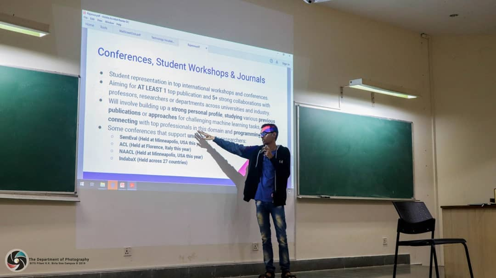

## Courses

* **Neurolinguistics and AI (Spring - 2020)**  [*Reading Course*] [*Teaching Assistant*]

* **Introduction to Machine Learning & Deep Learning (Fall - 2019)**  [[*CTE 2019*](<https://bpgc-cte.org/>)] [*Instructor*]

  

## Projects

* **Technology Incubator Programme (Fall - 2019)**  [*Project Lead*]
* **Deep Learning with PyTorch (Summer - 2019)**  [[*QSTP 2019*](<https://sites.google.com/view/qstp19/home>)] [*Project Mentor*]